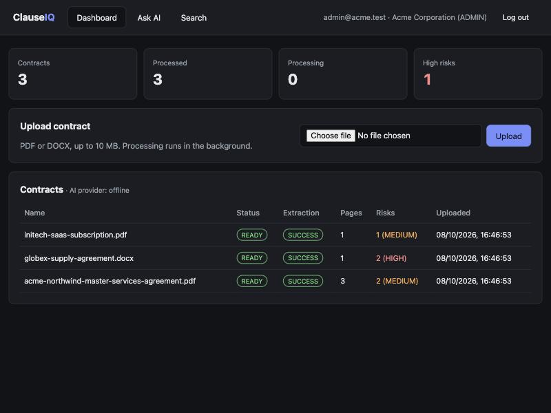
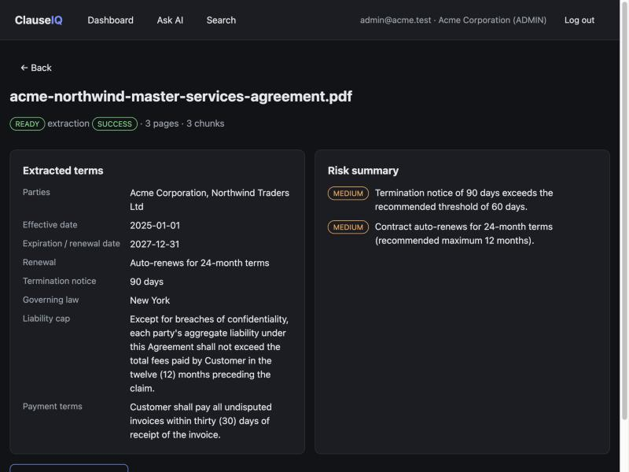
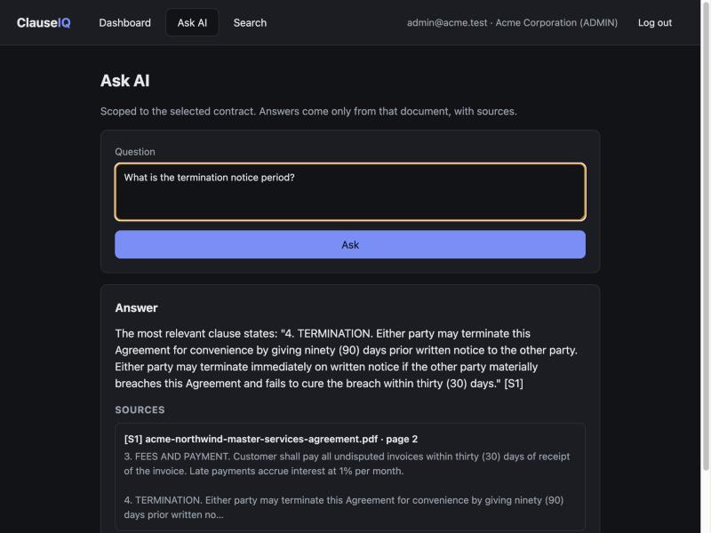
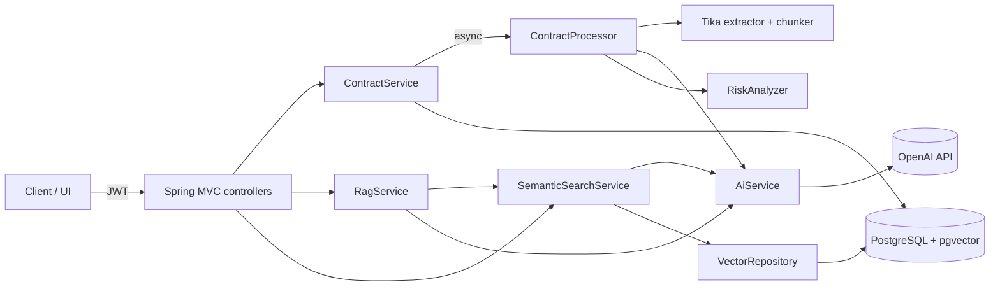

# ClauseIQ

**A multi-tenant, AI-powered contract intelligence platform built with Java 21 and Spring Boot.**

ClauseIQ lets organizations upload business contracts (PDF/DOCX), extracts key commercial terms with an LLM into a validated, strongly typed schema, flags risky clauses with deterministic rules, and answers natural-language questions using **retrieval-augmented generation (RAG)** over **pgvector** semantic search. Every answer cites the contract, page and chunk it came from. Every query, vector and prompt is scoped to the caller's tenant.



---

## Why this project

Contract lifecycle management (CLM) teams spend hours finding renewal dates, notice periods and liability caps buried in hundreds of contracts. ClauseIQ is a small, working version of that problem space, built to show:

| Skill | Where it lives |
|---|---|
| Java / Spring Boot backend engineering | Layered modular monolith: controller → service → repository |
| Multi-tenant SaaS architecture | Tenant derived only from the JWT; tenant-scoped repositories and SQL; isolation tests |
| LLM integration and prompt engineering | `AiService` abstraction, JSON-mode structured extraction, grounded RAG prompt |
| Semantic search and RAG | OpenAI embeddings → pgvector cosine search → top-K context → cited answers |
| Secure tenant isolation | Tenant filter applied *in SQL before ranking*; foreign IDs return 404 |
| Testing and code quality | 61 tests (unit + Testcontainers integration), JaCoCo coverage gate, GitHub Actions CI |

---

## Key features

- **Organization registration and JWT auth**: register an organization (tenant) with an ADMIN user, log in, BCrypt password hashing, stateless JWT, `ADMIN`/`USER` roles (admins can add users to their own tenant).
- **Contract upload**: PDF/DOCX only. The file type is verified from the **content (magic bytes)**, not the extension or the client's Content-Type. The size limit is 10 MB. Processing runs in the background.
- **Text extraction**: Apache Tika, with **real PDF page numbers** preserved. DOCX has no fixed pagination, so its page number is `null` rather than invented.
- **Paragraph-aware chunking**: chunks never span pages, so every citation's page number is exact.
- **Embeddings in pgvector**: each vector row carries `tenant_id` and `contract_id`. There is an HNSW cosine index.
- **Semantic search** (`POST /api/search`): tenant-filtered, with an optional single-contract scope.
- **RAG chat** (`POST /api/chat`): answers only from retrieved excerpts, with `[S1]`-style citations mapped back to contract, page and chunk. If nothing relevant is retrieved, the LLM is **not called** and the API returns a fixed "could not find enough information" answer.
- **Structured extraction**: parties, effective/expiration dates, renewal terms, termination notice, governing law, liability cap and payment terms. The output is parsed into a typed DTO and **validated** (ISO dates, ranges, date ordering). Invalid output is **retried once with the validation error fed back to the model**, then marked `FAILED`. The contract itself stays searchable.
- **Risk analysis**: deterministic, unit-tested rules: long termination notice, missing or unlimited liability cap, long auto-renewal, non-preferred governing law, and upcoming expiry. The LLM interprets clause wording; the risk decision is plain code.
- **Dashboard UI**: a single static page (vanilla JS) for the demo flow: dashboard, contract detail, Ask AI and search.

| Contract detail | RAG answer with citation |
|---|---|
|  |  |

> The screenshots were taken with the **offline AI provider** (no API key), which is why the answer is an extractive quote. With `OPENAI_API_KEY` set, answers are generated by the LLM with the same citation format.

---

## Architecture

A **modular monolith**: one deployable Spring Boot app, with packages organized so each module could be split into a service later.

```text
com.clauseiq
├── auth         registration, login, users, roles
├── tenant       Tenant entity
├── security     JWT service + filter, SecurityConfig, TenantContext
├── contract     upload, listing, detail, processing pipeline (ContractProcessor)
├── document     Tika text extraction, chunking, file storage
├── ai
│   ├── AiService            ← single seam for all AI calls
│   ├── provider             OpenAiService/OpenAiClient, OfflineAiService
│   ├── extraction           typed DTO, validator, persisted entity
│   ├── embedding            VectorRepository (pgvector via JDBC)
│   ├── rag                  RagService, ChatController
│   └── risk                 RiskAnalyzer (deterministic rules)
├── search       SemanticSearchService, SearchController
├── dashboard    tenant statistics
├── common       error handling
└── config       typed properties, AI provider selection, executor
```



### Upload and extraction pipeline

```text
POST /api/contracts/upload ─► validate type (magic bytes) + size ─► store file ─► contracts row (UPLOADED) ─► 202
                                                                                         │ background executor
                                                                                         ▼
 Tika text (per page) ─► paragraph chunks ─► embeddings ─► LLM extraction (validate, retry once) ─► risk rules
                                                                                         │ one short DB transaction
                                                                                         ▼
                    contract_chunks (+vector) · extracted_contract_data · risk_results · status READY
```

Slow AI calls happen **outside** database transactions; results are written in one short transaction.

### RAG pipeline

```text
question ─► embedding ─► pgvector cosine search WHERE tenant_id = :jwtTenant ─► top-K (≥ similarity threshold)
        └─► none relevant? → fixed "not enough information" answer (no LLM call)
        └─► grounded prompt with [S1..Sn] excerpts ─► LLM ─► answer ─► keep only cited sources ─► response
```

---

## Multi-tenancy design

Isolation is **shared database, shared schema, with a `tenant_id` column on every business table**, enforced in the application layer.

1. **The tenant comes from the JWT only.** `TenantContext.currentTenantId()` reads the verified principal. No request DTO has a `tenantId` field, and an extra `tenantId` in a body is ignored (this is tested).
2. **Every repository method is tenant-scoped**, for example `findByIdAndTenantId` and `findAllByTenantId…`. There is no unscoped lookup in the request path.
3. **Vector search filters by tenant in SQL before ranking:**
   ```sql
   SELECT ... FROM contract_chunks ch
   JOIN contracts c ON c.id = ch.contract_id AND c.tenant_id = ch.tenant_id
   WHERE ch.tenant_id = ? [AND ch.contract_id = ?]
   ORDER BY ch.embedding <=> ?::vector LIMIT ?
   ```
   Another tenant's chunks can never enter the top-K results, the RAG prompt or the response, however similar they are.
4. **Another tenant's resource returns `404 Not Found`, not `403`**, so IDs can't be probed.

`TenantIsolationIntegrationTest` covers all of this against real PostgreSQL + pgvector: list, get, risks, reprocess, delete, search, search with a foreign `contractId`, RAG context and citations, dashboard counts, a smuggled `tenantId`, and a repository-level test where tenant B holds 10 *identical* vectors and tenant A still gets none of them.

---

## Security

- BCrypt password hashing. Password hashes never leave the service layer and are never serialized.
- Stateless JWT (HS384, `JWT_SECRET` from the environment, minimum 32 bytes), with method-level authorization (`@PreAuthorize("hasRole('ADMIN')")`).
- Identical error for an unknown email and a wrong password (no account enumeration).
- Bean Validation on all inputs. Upload checks extension, **detected content type** and size. Stored filenames are random UUIDs, and path traversal is blocked.
- API keys come only from the environment or `.env` (git-ignored). Errors from the OpenAI client never include request headers (this is tested).

---

## Testing

```bash
mvn verify        # unit + integration tests + JaCoCo report + coverage gate
```

| Suite | What it covers |
|---|---|
| `TenantIsolationIntegrationTest` | Cross-tenant access through every endpoint and directly at the vector repository |
| `AuthIntegrationTest` | Register, login, invalid credentials, duplicate email, validation, tampered/missing JWT, role checks |
| `ContractPipelineIntegrationTest` | Real PDF/DOCX → Tika → chunks → pgvector → extraction → risks → cited chat; spoofed/unsupported files |
| `OpenAiServiceTest` (Mockito) | Extraction retry-once-then-fail, prompt grounding, no LLM call on empty context |
| `OpenAiClientTest` | OpenAI wire format against a local fake server: auth header, JSON mode, embedding ordering, error handling |
| `RagServiceTest` | Fallback answer, cited-source filtering, tenant passed through |
| `RiskAnalyzerTest`, `ExtractionValidatorTest`, `TextChunkerTest`, `DocumentTextExtractorTest`, `OfflineAiServiceTest` | Deterministic logic |

Integration tests use **Testcontainers** (`pgvector/pgvector:pg16`) and need Docker running. They use the offline AI provider, so they need **no API key** and are fully deterministic.

**Current result: 61 tests, all passing; about 88% line coverage** (the JaCoCo gate in `pom.xml` requires 60%). The HTML report is written to `target/site/jacoco/index.html`.

---

## Running locally

### Option A: Docker Compose (app + database)

```bash
cp .env.example .env          # then put your OPENAI_API_KEY in .env
docker compose up --build
```

Open http://localhost:8080.

### Option B: run with Maven

```bash
docker run -d --name clauseiq-db -p 5432:5432 \
  -e POSTGRES_DB=clauseiq -e POSTGRES_USER=clauseiq -e POSTGRES_PASSWORD=clauseiq \
  pgvector/pgvector:pg16
cp .env.example .env          # add OPENAI_API_KEY
mvn spring-boot:run
```

Flyway creates the schema, including the `vector` extension, on startup.

### Demo walkthrough

1. Open http://localhost:8080 and **register an organization** (for example "Acme Corporation").
2. **Upload** the fictional contracts in [`samples/`](samples/). They show as `PROCESSING`, then `READY`.
3. Open a contract to see the **extracted terms and risk summary**.
4. Click **Ask AI**: "What is the termination notice period?" The answer comes with its source and page.
5. Log out and **register a second organization**. Its dashboard, search and chat see none of the first tenant's contracts.

---

## Environment variables

| Variable | Default | Purpose |
|---|---|---|
| `OPENAI_API_KEY` | (none) | Enables the OpenAI provider |
| `AI_PROVIDER` | `auto` | `auto` uses OpenAI if a key is set, otherwise offline. `openai` fails fast without a key. `offline` is deterministic with no network |
| `OPENAI_CHAT_MODEL` | `gpt-4o-mini` | Chat model for extraction and answers |
| `OPENAI_EMBEDDING_MODEL` | `text-embedding-3-small` | 1536-dimension embeddings (matches the `vector(1536)` column) |
| `OPENAI_BASE_URL` | `https://api.openai.com/v1` | Any OpenAI-compatible endpoint |
| `JWT_SECRET` | dev placeholder | **Set in any shared environment** (32+ bytes) |
| `DB_URL` / `DB_USERNAME` / `DB_PASSWORD` | local `clauseiq` | PostgreSQL connection |
| `UPLOAD_DIR` | `./data/uploads` | Local file storage |

**Offline provider:** without a key, the app still starts and the whole pipeline runs (pgvector, tenant filtering, citations) using hashed bag-of-words embeddings, regex-based extraction and *extractive* answers (verbatim quotes, never generated text). It is a fallback for tests and keyless demos, not a replacement for the LLM; the logs say clearly which provider is active.

---

## API examples

```bash
# Register an organization (creates tenant + ADMIN) → returns a JWT
curl -s localhost:8080/api/auth/register -H 'Content-Type: application/json' \
  -d '{"organizationName":"Acme Corporation","email":"admin@acme.test","password":"a-strong-password"}'

TOKEN=...   # "token" from the response (or from /api/auth/login)

# Upload a contract (202 Accepted; processed in the background)
curl -s localhost:8080/api/contracts/upload -H "Authorization: Bearer $TOKEN" \
  -F file=@samples/acme-northwind-master-services-agreement.pdf

# List contracts / view one with extracted data + risks
curl -s localhost:8080/api/contracts -H "Authorization: Bearer $TOKEN"
curl -s localhost:8080/api/contracts/1 -H "Authorization: Bearer $TOKEN"

# Semantic search
curl -s localhost:8080/api/search -H "Authorization: Bearer $TOKEN" -H 'Content-Type: application/json' \
  -d '{"query":"contracts with a 90 day termination period"}'

# RAG chat (optionally add "contractId": 1 to scope to one contract)
curl -s localhost:8080/api/chat -H "Authorization: Bearer $TOKEN" -H 'Content-Type: application/json' \
  -d '{"question":"What is the termination notice period?"}'
```

Example chat response:

```json
{
  "answer": "Either party may terminate for convenience with ninety (90) days' prior written notice [S1].",
  "answered": true,
  "sources": [
    { "label": "S1", "contractId": 1, "contractName": "acme-northwind-master-services-agreement.pdf",
      "chunkId": 2, "chunkIndex": 1, "pageNumber": 2, "excerpt": "4. TERMINATION. Either party may ..." }
  ],
  "provider": "openai"
}
```

| Method | Path | Auth |
|---|---|---|
| POST | `/api/auth/register`, `/api/auth/login` | public |
| GET | `/api/auth/me` | user |
| GET / POST | `/api/users` | ADMIN |
| POST | `/api/contracts/upload` | user |
| GET | `/api/contracts`, `/api/contracts/{id}`, `/api/contracts/{id}/risks` | user |
| POST | `/api/contracts/{id}/reprocess` | user |
| DELETE | `/api/contracts/{id}` | ADMIN |
| POST | `/api/search`, `/api/chat` | user |
| GET | `/api/dashboard` | user |

---

## Design decisions

- **Modular monolith first.** It gives clear module boundaries without distributed-system overhead. `ai`, `document` and `contract` are the natural first services to extract.
- **The OpenAI REST API is called directly through a thin `RestClient` wrapper** (instead of a framework), so the prompts, JSON mode, retries and error handling are explicit and unit-testable. Swapping providers means implementing `AiService`.
- **JDBC for vectors, JPA for everything else.** JPA has no native vector type, and keeping the similarity SQL explicit makes the tenant filter easy to audit.
- **Deterministic risk rules on LLM-extracted fields**, so the risk output is reproducible, explainable and testable.

## Future improvements

- PostgreSQL **row-level security** as a second, database-enforced isolation layer
- pgvector `hnsw.iterative_scan` or per-tenant partial indexes to keep filtered ANN search accurate at large scale
- A message queue (e.g. Kafka) for ingestion, and splitting `ai`/`document` into separate services
- An extraction evaluation set (labelled contracts, per-field accuracy) and prompt versioning
- Hybrid search (BM25 + vectors), re-ranking, and OCR for scanned PDFs
- S3-compatible object storage, refresh tokens, per-tenant usage metering and rate limiting

---

*Sample contracts in `samples/` are fictional and generated for this demo.*
